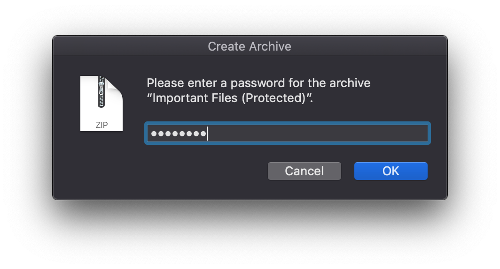
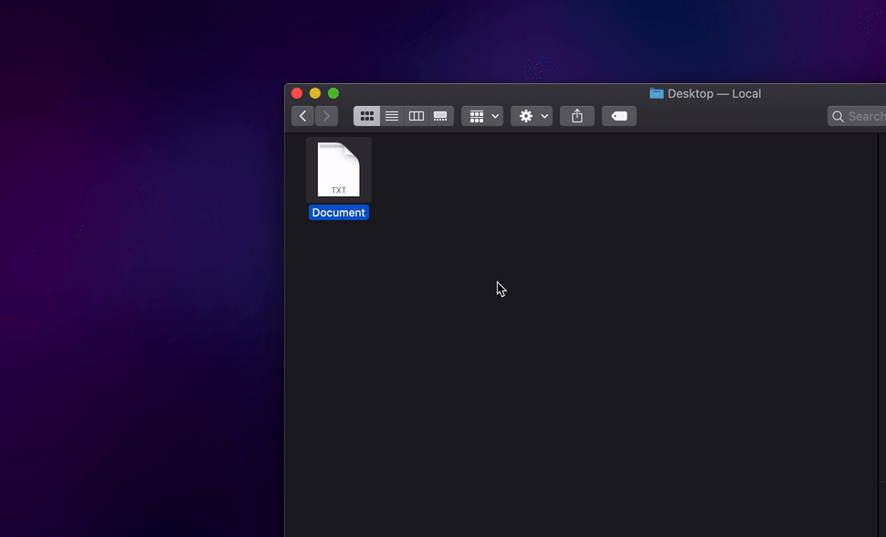
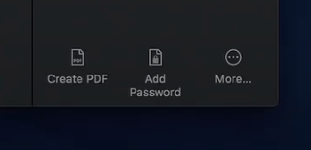
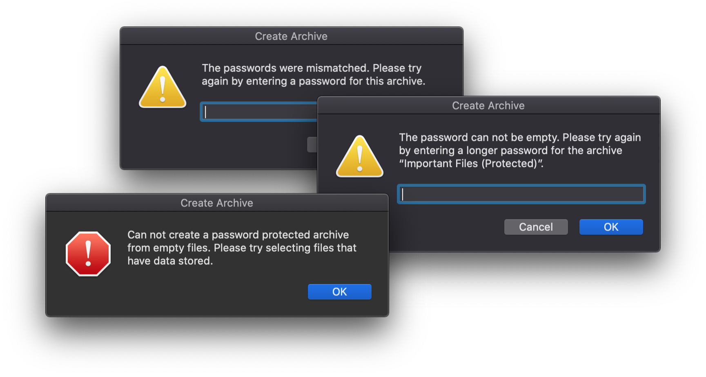
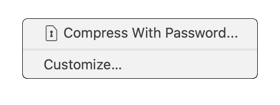
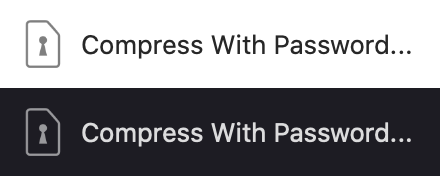

# Compress With Password
A macOS Finder Extension/Quick Action Automator workflow that allows the user to create a compressed ZIP file that is protected with a password in Finder.



<br />

# Installation
1. Download the latest release from [the releases page](https://github.com/RobinPerson/compress-with-password/releases).
2. Unzip the downloaded zip file. It will unpack an Automator workflow file.
3. Open the Automator workflow file using Automator Installer (which is usually the default application for this kind of file).
4. Select "Install" in the prompt asking you if you want to install this Automator workflow file as a Service.

## Optional: Rearrange Finder Extensions/Quick Actions
Rearranging Finder Extensions/Quick Actions depends on which version of macOS you are using. To see which version you are using you can open an information window in the menu bar under ` Apple > About This Mac`.

### On macOS 13 Ventura and newer
1. Open System Settings and navigate to `General > Login Items & Extensions`.
2. Scroll down to the section called "Extensions" and click on the "i" ⓘ that corresponds to Finder.
3. Drag and drop the Finder Extension with the title "Compress With Password..." so that the order of the Finder Extensions is to your liking. You can also hide any Finder Extensions from Quick Action lists/menus by disabling the toggle to the right of the Finder Extension in this list. (You will still be able to access them in the menu bar under `Finder > Services`)

### On macOS 12 Monterey and older
1. Open System Preferences and navigate to `Extensions > Finder`.
2. Drag and drop the Quick Action with the title "Compress With Password..." so that the order of the Quick Actions is to your liking. You can also hide any Quick Actions from Quick Action lists/menus by removing the checkmark in front of the Quick Action in this list. (You will still be able to access them in the menu bar under `Finder > Services`)

<br />

# Uninstall
Removing this Finder Extension/Quick Action depends on which version of macOS you are using. To see which version you are using you can open an information window in the menu bar under ` Apple > About This Mac`.

### On macOS 13 Ventura and newer
1. Open Finder and open the dialog in the menu bar under `Finder > Go > Go to Folder...`
2. Type in "`~/Library/Services`" and press return.
3. In the newly opened folder, drag the file named "`Compress With Password`" to the Trash.

### On macOS 12 Monterey and older
1. Open System Preferences and navigate to `Extensions > Finder`.
2. Right click the Quick Action with the title "Compress With Password..." and select "Move to Trash".

<br />

# Usage


<br />

1. Select the file(s) you want to compress with a password in Finder.
2. Right click the selection and select "Compress With Password..." from the Quick Actions sub menu. Or if you use the Preview menu in Finder select it from the Quick Actions list.
3. Give a password to secure your archive with, then click "OK" or pressing return.
4. Verify this password by entering it again, click "OK" or press return to start the creation of your archive.

<br />

# Behavior
The goal was to make a Finder Extension/Quick Action that behaves as close to what a built-in version of this functionality would look like. Initial inspiration comes from the Quick Action "Add Password" which was visible in the Apple WWDC Keynote from 2018.



*Image source: Apple Developer — WWDC 2018 Keynote — 1:43:27*

<br />

Because of this mindset, it was important to have a user-friendly process that would fit perfectly in macOS. The prompts use consistent terminology, are written neutrally and keep the user informed about what they are supposed to do and what the current situation is. 

These prompts will also be accompanied with relevant dialog icons pulled from the macOS system files, if these for any reason can't be found then the icons will fall back to icons that come built-in with system dialogs, the plus side of this functionality is that if macOS ever gets an icon overhaul, the prompts will stay in theme.

Most of the behavior is imitated from and inspired by the built-in behavior of the "Compress Items" function already present in Finder. This means that the created archive will be named after the selected file, but with "(Protected)" added. If the selection includes multiple files and or folders, it will default to the name "Archive (Protected)" similarly to the built-in functionality. Additionally, if that archive already exists it will add an incremented number to the end of the file name, nothing will ever be overwritten, nor any user input is needed, it just works.



I've tried to cover edge cases as well so that the user would run into the least possible amount of problems. These safeguards consist of:
- Preventing the user from mistyping a password, by making the user repeat the password they have entered. If the user mistypes the password they'll be informed that the password didn't match and to try setting a password again.
- Preventing the user from creating a zip file without a password by checking the length of the password and making sure that it's longer than 0 characters. If the user enters nothing on the first password prompt, they'll be informed that they can't use an empty password and to try setting a longer password.
-  Preventing the user from creating a zip file without a password by checking if the selected files have a size that's larger than 0, with folders it'll check for the items inside it as well. If the user selected only empty files and folders, they'll get an alert saying the files that were selected were empty and to try selecting different files.
-  If for any reason the constructed zip command gives an error, the user will get an alert saying that an unexpected error occurred and to try it again.

Additionally, the script used in this Finder Extension/Quick Action is set up so that it ignores the common ".DS_Store" and "__MACOSX" macOS hidden files, so that the resulting archive is clear of these. This setting can be turned off easily by editing the script.

<br />

# Editing
The script is mostly made in AppleScript. In order to edit the Finder Extension/Quick Action directly, you need to open the workflow file with Automator specifically, as long as the workflow file is not installed as a Service the default application will be Automator Installer. Right clicking the workflow file and opening it with Automator is a way to do this correctly.

Since the actual code is AppleScript in a "Run AppleScript" module in an Automator workflow, it might not be as easily accessible, so I included an AppleScript as well as a plain TXT file with the exact same code that is in that module.

The strings for user facing prompts and file naming schemes are bundled together and written so that it's easily editable, either for localization, fixing typos or changing the text altogether.

## Important Notices
**When you save the workflow file in Automator it will revert all changes made to the macOS Property List file inside the workflow.** This means that changes such as the display name as well as the icon name will revert to the customization that Automator allows for. This causes the display name to become the workflow file name and the icon for this Finder Extension/Quick Action will stop displaying the proper sizes as well as stop displaying the correct color for both Dark mode as well as Light mode.

These changes can however be fixed again by manually editing the macOS Property List file as shown in the next few chapters. Because of the tediousness off these steps, you might want to hold off on them until you're sure the changes to your workflow are complete and as bug free as possible.

Note that in order to make these changes to appear correctly you will have to **install the workflow file as a Service through Automator Installer again**. Editing the Automator workflow while it's already installed as a Service might not reflect these changes properly.

## Changing the Display Name
Changing the display name of a Finder Extension/Quick Action can be useful to not have to have an Automator workflow file with unicode characters, long sentences or multiple periods for an ellipsis in the file name.
1. In Finder, right click the Automator workflow file and select "Show Package Contents".
2. Navigate to the `Contents` folder and open the Info.plist file in any macOS Property List editor (such as Xcode).
3. In your PLIST editor, search for the key "`Menu item title`", which should be under `Information Property List > Services > Item 0 (runWorkflowAsService) > Menu`.
4. Change the value of this key to your desired display name. (e.g.: Compress With Password...)
5. Save the changes you made and close the PLIST document.

## Changing the Icon Name
Changing the icon name is crucial for macOS to display the Finder Extension/Quick Action icon properly as it needs to know it has to interpret a specific multi-image TIFF file correctly.
1. In Finder, right click the Automator workflow file and select "Show Package Contents".
2. Navigate to the `Contents` folder and open the Info.plist file in any macOS Property List editor (such as Xcode).
3. In your PLIST editor, search for the key "`NSIconName`", which should be under `Information Property List > Services > Item 0 (runWorkflowAsService)`.
4. Change the value of this key from "`workflowCustomImage`" to "`workflowCustomImageTemplate`".
5. Save the changes you made and close the PLIST document.
6. In Finder, from the `Contents` folder, navigate to the `Resources` folder.
7. Rename the file "`workflowCustomImage`" to "`workflowCustomImageTemplate`". (The file can have its extension set to hidden, but this is not needed)

For creating a TIFF file that works correctly with these steps, please read [the next chapter](#icon).

<br />

# Icon
I couldn't find a proper explanation nor documentation on how to give an Automator workflow a Finder Extension/Quick Action icon that works correctly on macOS in Dark mode as well as Light mode at multiple sizes. That's why I'll include a tutorial of the minimum requirements I figured out to make this work.



To make a Finder Extension/Quick Action icon that is compatible with macOS and its Light and Dark modes, you need at least three different PNG files with the outline of the icon shape or the icon itself colored in black on top of a transparent background, no other colors. Anti-aliased semi-transparent shades of black are allowed, as long as there is no other color other than #000000 (pure black). (See the example icons in this repository)

These three PNG files should preferably be a bundle of the same icon at different sizes:
- 16x16 pixels at 72 pixels/inch resolution
- 32x32 pixels at 144 pixel/inch resolution
- 48x48 pixels at 216 pixels/inch resolution

Which for the most part imitates Apple's guidelines on creating @2x and @3x versions of the same icon.

To bundle these together into a single TIFF you can use the terminal command `tiffutil` which comes bundled in with macOS.  Other methods may or may not work. Use this utility with precaution and only on files you trust.

For the bundled icons in this repository the command looks like this:
```sh
tiffutil -cat small.png medium.png large.png -out workflowCustomImageTemplate.tiff
```
Which will create a compatible TIFF file ready to be used in an Automator workflow.

To add this icon to the workflow, open the workflow in Automator and in the top workflow properties section, next to Image select "Choose..." and pick the TIFF file that was created using the prior command. Then save the changes and close the workflow document. Afterwards you will have to proceed with the steps from the [Changing the Icon Name](#changing-the-icon-name) chapter earlier in this readme. (You may also have to do the steps from the [Changing the Display Name](#changing-the-display-name) chapter if you had that customized as well)

<br />



<br />

# Thanks
In order to make this Finder Extension/Quick Action come to reality, I've consulted some articles online as inspiration. I'd like to give thanks to the creators of these since they (indirectly) helped me figure things out.

- User [redsky](https://apple.stackexchange.com/users/347536/redsky) on the Apple StackExchange, for [general inspiration of the password dialogs](https://apple.stackexchange.com/a/370969).
- Matthias Gansrigler, for [an article on his blog](https://blog.eternalstorms.at/2018/10/19/developer-tip-custom-icons-for-quick-actions/) that talks about how to set a custom icon for Finder Extensions/Quick Actions and make it show up properly throughout macOS.

For everything else, I've mostly stuck to experimenting and consulting documentation where possible.

<br />
